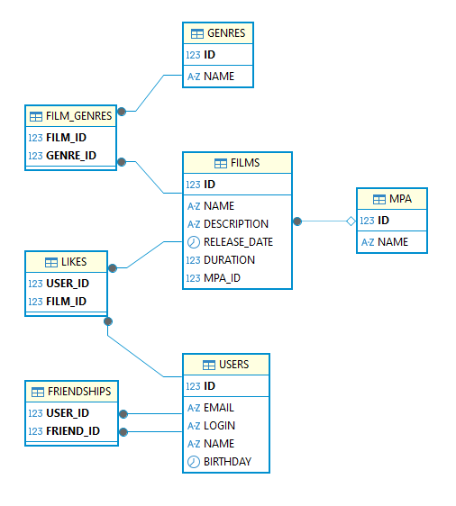

# java-filmorate
Template repository for Filmorate project.

# 1 Как устроена база данных


# 2 Работа приложения
**Когда приходит HTTP-запрос:**

Клиент -> Controller -> Service -> Repository -> База данных

**Ответ приложения:**

База данных -> Repository -> Service -> DTO -> Controller -> JSON-ответ

# 3 SQL-запросы приложения:

## 3.1 Запросы для фильмов (`films`)

### Создание и обновление

**Вставка нового фильма**
```sql
INSERT INTO films (name, description, release_date, duration, mpa_id)
VALUES (?, ?, ?, ?, ?);
```
**Обновление существующего фильма**
```sql
UPDATE films
SET name = ?, description = ?, release_date = ?, duration = ?, mpa_id = ?
WHERE id = ?;
```
### Получение данных:
**Все фильмы**
```sql
SELECT * FROM films;
```

**Фильм по ID**
```sql
SELECT * FROM films WHERE id = ?;
```

**Фильм по названию**
```sql
SELECT * FROM films WHERE name = ?;
```

### Лайки: 
**Добавить лайк**
```sql
INSERT INTO likes (user_id, film_id) VALUES (?, ?);
```

**Удалить лайк**
```sql
DELETE FROM likes WHERE user_id = ? AND film_id = ?;
```

**Получить всех пользователей, поставивших лайк фильму**
```sql
SELECT user_id FROM likes WHERE film_id = ?;
```

### Топ‑фильмов по лайкам: 
```sql
SELECT f.*
FROM films AS f
LEFT JOIN likes AS l ON f.id = l.film_id
GROUP BY f.id
ORDER BY COUNT(l.user_id) DESC
LIMIT ?;
```

## 3.2 Запросы для пользователей (`users`)
### Создание и обновление:
**Создать пользователя**
```sql
INSERT INTO users (email, login, name, birthday)
VALUES (?, ?, ?, ?);
```

**Обновить пользователя**
```sql
UPDATE users SET email = ?, login = ?, name = ?, birthday = ? WHERE id = ?;
```

### Получение данных:
**Все пользователи**
```sql
SELECT * FROM users;
```

**Пользователь по ID**
```sql
SELECT * FROM users WHERE id = ?;
```

**Пользователь по email**
```sql
SELECT * FROM users WHERE email = ?;
```

## 3.3 Запросы для жанров (`genres`)

**Все жанры (сортировка по ID)**
```sql
SELECT * FROM genres ORDER BY id
```

**Жанр по ID**
```sql
SELECT * FROM genres WHERE id = ?;
```

## 3.4 Запросы для связей фильмов и жанров (`film_genres`)

**Добавить связь фильма с жанром**
```sql
INSERT INTO film_genres (film_id, genre_id) VALUES (?, ?);
```

**Удалить все связи жанров для фильма (перед обновлением)**
```sql
DELETE FROM film_genres WHERE film_id = ?;
```

**Получить жанры фильма**
```sql
SELECT g.id, g.name
FROM genres AS g
JOIN film_genres AS fg ON g.id = fg.genre_id
WHERE fg.film_id = ?;
```

## 3.5 Запросы для рейтингов MPAA (`mpa`)

**Все рейтинги (сортировка по ID)**
```sql
SELECT * FROM mpa ORDER BY id
```

**Рейтинг по ID**
```sql
SELECT * FROM mpa WHERE id = ?
```

## 3.6 Запросы для дружбы (`friendships`)

**Добавить друга**
```sql
INSERT INTO friendships (user_id, friend_id) VALUES (?, ?);
```

**Удалить друга**
```sql
DELETE FROM friendships WHERE user_id = ? AND friend_id = ?;
```

**Получить друзей пользователя**
```sql
SELECT friend_id FROM friendships WHERE user_id = ?;
```

**Общие друзья двух пользователей**
```sql
SELECT f1.friend_id
FROM friendships f1
JOIN friendships f2 ON f1.friend_id = f2.friend_id
WHERE f1.user_id = ? AND f2.user_id = ?;
```

# 4 Слои приложения
## 4.1 Controller

**Контроллеры** принимают HTTP-запросы. Их задача - только принять запрос и передать его дальше. 

Например,   POST /films;    GET /users;     PUT /users/1/friends/2

Контроллер:
- получает JSON-ответ
- превращает его в Java-объект, например NewFilmRequest
- запускает валидацию через @Valid
- вызывает сервис
- возвращает результат клиенту
- 
## 4.2 DTO           
**DTO** - это специальные объекты для передачи данных между клиентом и сервисом. 
Помогают отделить внутреннюю модель от внешего API.

Например:
- NewFilmRequest - что клиент присылает при создании фильма
- UpdateFilmRequest - что клиент присылает при обновлении фильма
- FilmDTO - что сервер возвращает клиенту

## 4.3 DTO‑мапперы
**Назначение:** - преобразование между бизнес‑сущностями (Film, User) и DTO (FilmDto, UserDto).

#### *Ключевые характеристики:*
- не связаны с БД или JDBC;
- работают на уровне API (контроллеры);
- преобразуют объект Java → DTO и DTO → объект Java;
- управляют тем, какие данные отправляются клиенту.

#### *Когда используются:*
В контроллерах (FilmController, UserController) при обмене данными с клиентом.

#### *Примеры вызовов:*
```
DTO → Entity (при создании)
Film film = FilmMapper.mapToFilm(filmRequest);

Entity → DTO (при ответе)
FilmDto dto = FilmMapper.mapToFilmDto(film);
```

#### *Что делают методы FilmMapper:*
- mapToFilm() — преобразует NewFilmRequest (DTO от клиента) в Film (сущность для сохранения);
- mapToFilmDto() — преобразует Film (из БД) в FilmDto (для отправки клиенту);
- updateFilmFields() — обновляет поля существующего Film на основе UpdateFilmRequest.

## 4.4 DAL
**DAL (Data Access Layer)** - (слой доступа к данным) это часть приложения, 
которая отвечает за взаимодействие с базой данных:
- выполняет SQL‑запросы;
- преобразует данные из БД в Java‑объекты и обратно;
- скрывает детали работы с БД от бизнес‑логики.

Содержит:
- репозитории (FilmRepository, UserRepository и др.) — выполняют SQL-запросы и вызовы JDBC;
- мапперы (FilmRowMapper, UserRowMapper) — преобразуют строки из БД в объекты.

### 4.4.1 Mapper‑классы

Mapper‑классы реализуют паттерн RowMapper из Spring JDBC.
Их задача — преобразовать одну строку из ResultSet (результат SQL‑запроса) в полноценный Java‑объект.

#### *Работа маппера:*
- берёт строку ResultSet из таблицы films;
- извлекает значения по именам колонок (id, name, release_date и др.);
- создаёт объект Film;
- извлекает значения из колонок текущей строки ResultSet;
- устанавливает эти значения в поля объекта Film на основе данных из строки;
- возвращает готовый объект Film.

#### *Когда вызывается:*
- при запросе одного фильма (queryForObject);
- при запросе списка фильмов (query), где Spring вызывает mapRow для каждой строки.

#### *Ключевые характеристики:*
- реализуют интерфейс RowMapper<T> из Spring JDBC;
- работают на уровне DAL (Data Access Layer);
- вызываются автоматически JdbcTemplate при выполнении запросов;
- преобразуют строку из БД → объект Java.

### 4.4.2 Repository
**Репозитории** - работают напрямую с базой данных.

Репозитории отвечают на вопрос: *"Как именно получить или сохранить данные в БД?"*


## 4.5 Service

**Сервис** - содержит бизнес-логику. 

Отвечает на вопрос: *"Что должно произойти?"*

Именно тут решается:
- можно ли создать фильм
- существует ли ползователь
- существует ли жанр
- можно ли поставить лайк
- нужно ли изменить пустое имя пользователя логином
- нужно ли выбросить исключение

# 5 Как работает создание фильма
Допустим, клиент отправляет
```
{
  "name": "Интерстеллар",
  "description": "Космос",
  "releaseDate": "2014-11-07",
  "duration": 169,
  "mpa": { 
    "id": 3 
  },
  "genres": [
    { "id": 2 },
    { "id": 6 }
  ]
}
```


**Шаг 1. Controller**

FilmController.createFilm() получает JSON и превращает его в NewFilmRequest.

**Шаг 2. Validation**

Spring проверяет:
@NotBlank,
@NotNull,
@Positive,
@Size,
@PastOrPresent

Если что-то не так — сразу вернётся 400.

**Шаг 3. Service**

FilmService.createFilm():
- проверяет дату релиза
- проверяет, существует ли mpa
- проверяет, существуют ли жанры
- вызывает FilmMapper.mapToFilm()
- 
**Шаг 4. Mapper**

FilmMapper превращает DTO в модель Film.

Например, 
film.setRatingId(request.getMpa().getId());
film.setGenres(request.getGenres());

**Шаг 5. Repository**

FilmRepository.save():

- вставляет фильм в таблицу films
- получает новый id
- сохраняет жанры в таблицу film_genres
- загружает лайки, жанры и mpa обратно
- возвращает готовый объект


